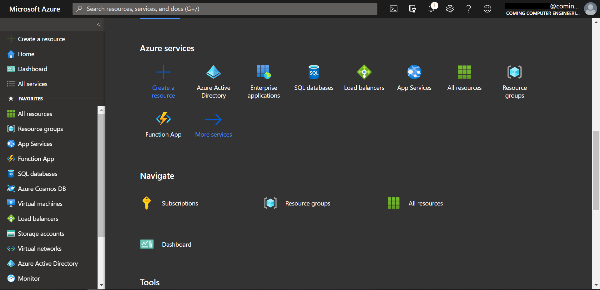
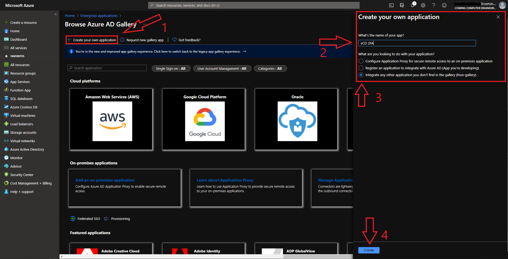
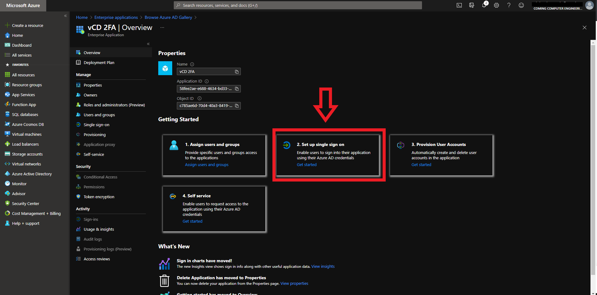
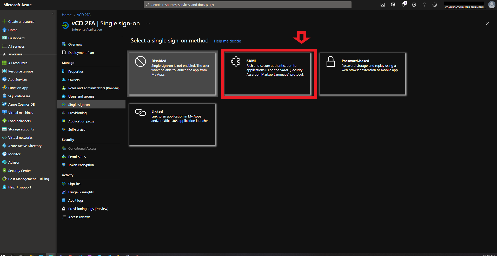
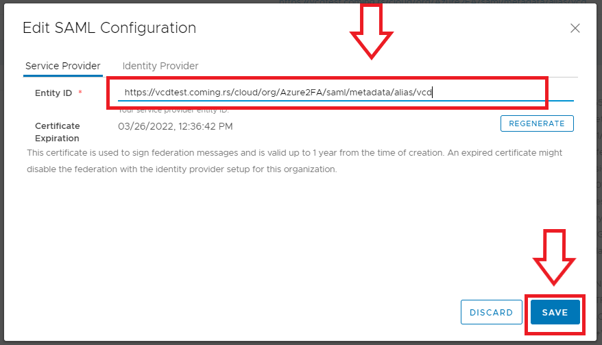
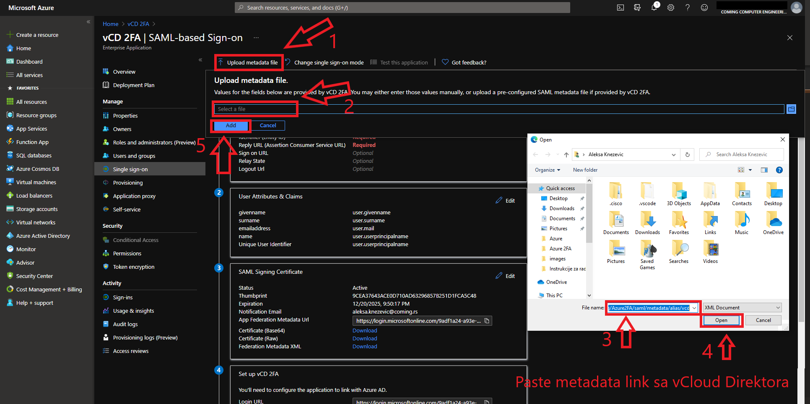
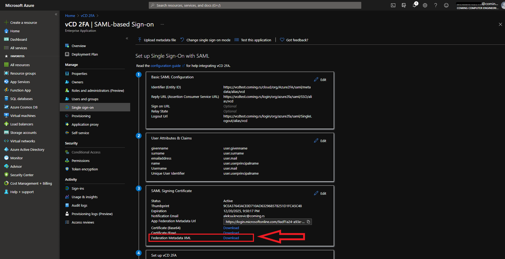

# vCloud SAML autentifikacija sa Azure AD-om

U nastavku je opisan proces konfiguracije AAD-a i vCloud direktora za potrebe 2FA.

__Proces ukratko:__

1. Kreiranje Enterprise App u Azuru
2. Podešavanje Single Sign On-a na Azuru
3. Podešavanje SAML-a na VMware Cloud Director-u
4. Podešavanje atributa i claimova aplikacije na Azuru
5. Import vCloud federation metadata to AzureAD
6. Importovanje korisnika u vCD-u
7. Testiranje funkcionalnosti

Pre nego počnemo:

__Morate imati neku od sledećih titula na Azuru:__

``` 
 * Global Administrator
 * Cloud Application Administrator
 * Application Administrator
 * Owner of the service principal.
```

##  __Kreiranje Enterprise aplikacije na Azuru__

 Kao početni korak, ulogovaćemo se na [Azure portal](https://portal.azure.com). </br>




 Nakon logovanja, dobijamo mogućnost kreiranja Enterprise aplikacije. </br>
 Ako se Enterprise aplikacija ne pojavi na početnom ekranu, možemo je pretražiti u Search bar-u.</br>
 Kreiramo novu aplikaciju za naše potrebe klikom na dugme New Application, slika ispod.


Na sledećem prozoru je potreno odabrati kreiranje nove aplikacije, zatim moramo joj zadati ime i izabrati opciju (Non-Gallery). Uputstvo na slici ispod.



Nakon kreiranja aplikacije, pojaviće se prozor sa aplikacijom. Klikom na Single sign on prelazimo na podešavanja




Prelazimo na prozor gde biramo način autentifikacije, biramo SAML.
## Podešavanje SSO-a na Azuru



Otvoriće nam se prozor sa podešavanjima atributa i claim-ova.

## Nakon ovog koraka prelazimo na podešavanje VMware Cloud Director-a

* Biramo adresu našeg tenanta, i odlazimo na tab __Applications__. </br>
* Biramo sa leve  strane meni  __Identity Providers__ i pronalazimo __SAML__ podešavanje.</br>
* Kopiramo __Metadata__ link i kliknemo iznad dugme  __Edit__. </br>
Podešavanje po koracima na slici ispod.


Otvoriće se Edit SAML Configuration prozor, i prazno polje Entity ID u koje ćemo nalepiti link koji smo iskopirali na prethodnom koraku i snimiti.



## Nakon ovog koraka vraćamo se na podešavanje SAML-a na Azuru.

Sada podešavamo SAML metadata na Azuru.
1. Kliknemo na dugme __Upload metadata file__.
2. Zatim kliknemo __Select a file__. 
    </br>Pojaviće se prozor u kom možemo da dodamo link.
3. Nalepimo link koji smo prethodno iskopirali sa VMware Cloud Director-a. 
4. Sačuvamo link koji smo nalepili.
5. Kliknemo __Add__ dugme.
</br>



Nakon petog koraka, pojaviće se prozor, potrebno je kliknuti __Save__ dugme.


Potrajaće proces nekih 5-10 sekundi, nakon toga videćemo da su se neki podaci promenili: Identifier, Reply URL i Logout URL.

Potrebno je promeniti polje __User Attributes and Claims__, uputstvo na slici ispod.

Nakon klika na __Edit__ dugme, otvoriće nam se podešavanje ovog polja.
</br>
Kliknemo na dugme __Add new claim__. </br>


Otvoriće se prozor u koji možemo da dodamo atribute i claimove.


Potrebno je kreirati 2 claima, Username i Roles. </br>
Podaci koji treba da se unesu u prvi claim su:
</br>
```
Username 

Name:              Username   
Namespace:         https://schemas.xmlsoap.org/ws/2005/05/identity/claims/UserName/Username
Source Attribute:  user.mail
```

Nakon dodavanja ovih podataka potrebno je snimiti ovaj claim i ponoviti identične operacije sa podacima ispod.

```
Roles 

Name:              Roles   
Namespace:         http://schemas.xmlsoap.org/ws/2005/05/Roles
Source Attribute:  user.assignedroles
```

Nakon kreiranja claimova, vraćamo se na __Single Sign On__ stranicu naše aplikacije.</br>
Pojaviće se prozor koji izgleda kao na slici ispod.



Nakon download-ovanja Federation Metadata, vraćamo se na VMware Cloud Director.</br>
 
Potrebno je nalepiti te podatke u Identity provider.
</br>
Vraćamo se u prozor gde smo nalepili link od Identity providera.</br>
__To radimo tako što biramo Edit opciju u SAML Configuration prozoru__


Nakon toga biramo tab __Identity Provider__.
</br>
* Uključujemo __Use SAML Identity Provision:__.
* Kliknemo __Browse__ dugme.
* Nadjemo downloadovani xml file (u prethodnom koraku smo sa azura skinuli fajl).
* Uploadujemo ga na vCloud Direktor.
* Snimimo podešavanje. 
  


Nakon ovog koraka, uspešno smo kreirali 2FA na VMware Cloud Direktoru.

Ono što nam preostaje je da dodamo korisnike u našu aplikaciju da bi smo imali mogućnost logovanja na vCD.